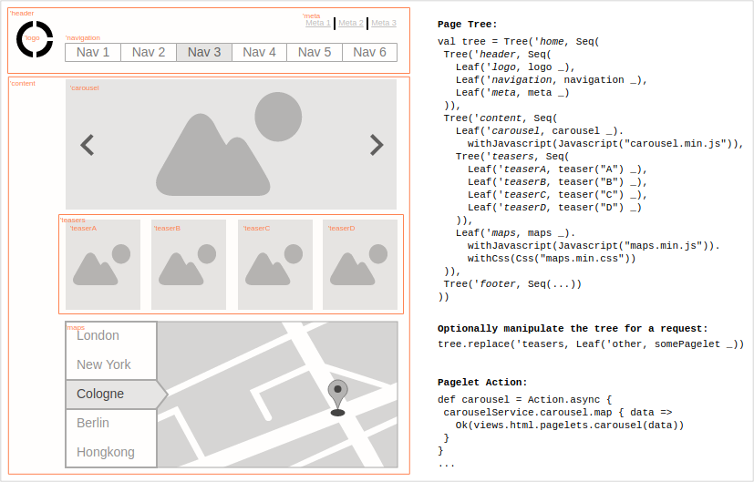

# Pagelets
A Module for the Play Framework to build modular applications in an elegant and concise manner.

Check out the [sample project](https://github.com/splink/pagelets-seed) to see a sample application based on Play Pagelets.  

### Idea
The idea behind the Pagelets Module is to split a web page into small, composable units. Such a unit is called a pagelet. 
In terms of the Play Framework a pagelet is just a simple Action[AnyContent]. That means that a pagelet is basically a (small) 
web page. Pagelets can be arranged in a page tree. So, if a user requests a page, the page is constructed according to it's  page tree. It is also possible to serve any part of the tree down to a single pagelet individually. 
The ordinary pagelet consists of a view, resources (JavaScript, Css), a controller action and a service to fetch data.  

Pagelets are particularly useful if you want to serve tailor-made pages to your visitors. For instance you can easily 
serve a slightly different page to users from different countries (i18n), or perform A/B testing, or fine-tune the page 
based on the user (logged-in, gender, other preferences, ...).

Pagelets comes in two flavours:
*Async* and *Streaming*. *Async* composes the complete page on the server side and sends it back to the 
client, as soon as all pagelets are complete. *Streaming* on the other hand, begins to send the page immediately to the
client and pagelets appear sequentially as soon as they complete. 

### Traits
- **composable**: multiple pagelets can be composed into a page. A page is just a tree of pagelets. Any part of the pagelet tree can be served to the user. 
- **resilient**: if a pagelet fails, a fallback is served. Other pagelets are not affected by the failure of one or more pagelets. 
- **simple**: to create a pagelet is simple compared to a whole page, because of its limited scope. To compose a page from pagelets is simple.
- **modular**: any pagelet can be easily swapped with another pagelet, removed or added to a page at runtime.

Pagelets are non invasive and not opinionated: You can stick to your code style and apply the patterns you prefer. Use your favorite dependency injection mechanism and template engine. You don't need to apply the goodness of pagelets everywhere, only employ pagelets where you need them. Pagelets also do not introduce additional dependencies to your project. 

### Quickstart
To get the idea how Pagelets look in code, read on and check out the [play pagelets seed project](https://github.com/splink/pagelets-seed) afterwards.
> The Pagelets Module depends on the Play Framework.

Add the following lines to your build.sbt file:

#### Play 2.8 (Scala 2.12 | Scala 2.13)
~~~scala
libraryDependencies += "org.splink" %% "pagelets" % "0.0.10
~~~

##### For older Play/Scala versions:
###### Play 2.5 (Scala 2.11)
~~~scala
libraryDependencies += "org.splink" %% "pagelets" % "0.0.3
~~~

###### Play 2.6 (Scala 2.11 | Scala 2.12)
~~~scala
libraryDependencies += "org.splink" %% "pagelets" % "0.0.8
~~~

~~~scala
routesImport += "org.splink.pagelets.Binders._"
~~~

If you want to use streaming, you will also need:
~~~scala
TwirlKeys.templateFormats ++= Map("stream" -> "org.splink.pagelets.twirl.HtmlStreamFormat")
TwirlKeys.templateImports ++= Vector("org.splink.pagelets.twirl.HtmlStream", "org.splink.pagelets.twirl.HtmlStreamFormat")
~~~
this adds streaming capabilities to the Twirl template engine. To use the streaming template format, you must name your
templates *name.scala.stream* instead of *name.scala.html*

Now add the following line to your application.conf file, to enable the Pagelets module:
~~~
play.modules.enabled += org.splink.pagelets.pageletModule
~~~
Create a standard Play controller and inject a *Pagelets* instance. In this example Guice is used as DI framework, but 
any DI mechanism works.
~~~scala
@Singleton
class HomeController @Inject()(pagelets: Pagelets)(implicit m: Materializer, e: Environment) extends InjectedController
~~~

Bring pagelets into scope
~~~scala
import pagelets._
~~~

To use the Play's Twirl template engine, import TwirlConversions
~~~scala
import org.splink.pagelets.twirl.TwirlCombiners._
~~~
To use Streaming, additionally import HtmlStreamOps
~~~scala
import org.splink.pagelets.twirl.HtmlStreamOps._
~~~

Now create the main template inside the *views* folder.
Name the file *wrapper.scala.html* or, if you want to use streaming, name it *wrapper.scala.stream*
~~~scala
 @(resourceRoute: String => Call)(page: org.splink.pagelets.Page)
 
 <!DOCTYPE html>
 <html>
     <head>
         <title>@page.head.title</title>
         <link rel="stylesheet" media="screen" href='@routes.Assets.versioned("stylesheets/main.min.css")'>
         <link rel="shortcut icon" type="image/png" href="@routes.Assets.versioned("images/favicon.png")">
 
         @page.head.metaTags.map { tag =>
           <meta name="@tag.name" content="@tag.content" />
         }
 
         @page.head.css.map { css =>
             <link rel='stylesheet' media='screen' href='@{resourceRoute(css.toString).url}'>
         }
 
         
         @page.head.js.map { js =>
             
         }
     </head>
     <body>
         @Html(page.body)
 
         @page.js.map { js =>
             
         }
     </body>
 </html>
~~~
The main template receives a resource route which is needed to reference the JavaScript and Css resources for the page.
The template is also provided with a *Page* instance which contains all parts necessary to render the page: HTML body, 
JavaScript, Css and Meta Tags.

Create a simple pagelet template inside the views folder:
~~~scala
@(name: String)

@name

~~~

Create a simple pagelet inside the controller:
~~~scala
def pagelet(name: String)() = Action {
  Ok(views.html.pagelet(name))
}
~~~

Define the page composition:
~~~scala
def tree(r: RequestHeader) = {
  val tree = Tree("root".id, Seq(
    Leaf("header".id, pagelet("header") _).withJavascript(Javascript("header.min.js")).setMandatory(true),
    Tree("content".id, Seq(
      Leaf("carousel".id, pagelet("carousel") _).withFallback(pagelet("Carousel") _).withCss(Css("carousel.min.css")),
      Leaf("text".id, pagelet("text") _).withFallback(pagelet("Text") _)
    )),
    Leaf("footer".id, pagelet("footer") _).withCss(Css("footer.min.css"))
  ))
  
  if(messagesApi.preferred(r).lang.language == "de") tree.skip("carousel".id) else tree
}
~~~
There are 2 different kinds of pagelets: Leaf pagelets and Tree pagelets. A Leaf pagelet references an actual Action, while
a Tree pagelet combines its children into one. When a request arrives, the tree of pagelets is constructed. 
All Leaf pagelets are executed in parallel and as soon a the children of a Tree pagelet complete, they are combined.
This process continues, until just the root pagelet remains.

Resources and fallbacks can be defined per pagelet. If a pagelet fails to render, its fallback pagelet is rendered. 
Resources are assembled and combined by type and references are later provided to the main template.

The *skip* and *replace* operations are available on instances of *Tree*. They allow to change the tree at runtime. 
For instance, the tree can be changed based on the language of an incoming request. Note that the resources for the skipped 
pagelet are also excluded. If the request language is "de", the carousel pagelet and all its resource dependencies are 
left out. 

In this example the header pagelet is declared as mandatory, so if the header fails, the user is redirected to an (error) 
page. Note that Tree pagelets can't fail or depend on resources.

The carousel pagelet depends on *carousel.min.css* and the footer pagelet depends on *footer.min.css*. If the tree is 
constructed, both *carousel.min.css* and *footer.min.css* are concatenated into one file whose name is the fingerprint of 
its contents. This sole Css file which consists of carousel and footer styles is then served under its fingerprint.

 
Now add an index Action to the controller to render the complete page.
If you want to use *async*, add:
~~~scala
def index = PageAction.async(routes.HomeController.errorPage)(_ => "Page Title", tree) { (request, page) =>
  views.html.wrapper(routes.HomeController.resourceFor)(page)
}
~~~

If you prefer to use *streaming*, add:
~~~scala
def index = PageAction.stream(_ => "Page Title", tree) { (request, page) =>
  views.html.wrapper(routes.HomeController.resourceFor)(page)
}
~~~

Both flavours require the page title, the pagelet tree configuration and a function which receives the request and page 
as arguments. In the *async* case the function must return a *Writeable* and in the *streaming* case a 
*Source[Writeable,_]*. A *Writeable* is just a type class which is capable of transforming the wrapped class eventually to a 
HTTP response.
*errorPage* is only required in the *async* case. It is called, if a mandatory pagelet and its fallback fail to render.
The *streaming* case can't redirect to another page in case some mandatory pagelet failed, because at the time, the
pagelet fails, parts of the page are already streaming to the client, thus it's too late.

Finally add the route to conf/routes
~~~scala
GET  /                              controllers.HomeController.index
GET  /resource/:fingerprint         controllers.HomeController.resourceFor(fingerprint: String)
~~~

### Details

#### Advantages
- Resilient: if one part of the page fails, the other pagelets remain unaffected. A fallback can be defined per pagelet. 
If a fallback fails, the pagelet is simply left out. If a pagelet is declared as mandatory and its fallback also fails,
the request is redirected to a configurable error page.

- Modular: a pagelet is an isolated and independent unit. Assets like JavaScript and Stylesheets are defined on a per pagelet
basis so a pagelet is completely autonomous. A pagelet can be easily reused on any page.

- Flexible: a page can be composed with very little code, and the composition can be changed at runtime. Specific 
pagelets can be replaced with others, removed or new pagelets can be added anywhere in the page with just a line of code.
This is quite handy to conduct A/B tests or to serve a different page based on the user properties like locale, user-role, ...

- Simple: to create a pagelet is much simpler then to create a complete page, because the scope of a pagelet is small.
The composition of a page from pagelets is just a bit of configuration code and thus also simple. So all steps
required to build a page are simple.

- Logs: Detailed logs help to gain useful insights on the performance and to find bottlenecks quickly.

- Performant #1: all pagelets in a page tree are executed in parallel, so splitting a page into paglets induces no 
perceptible overhead. 

- Performant #2: Resources are automatically concatenated and hashed as well as served with far future expiration dates. 
Therefore browsers need to make only few requests, and - as long as the resources haven't changed - can pull them from 
the local cache.

- Performant #3: A page can optionally be streamed which effectively reduces the time to first byte to milliseconds and
enables the browser to start loading resources immediately.

- Separation of concerns: by using pagelets, you automagically end up with a clean and flexible application design.

#### Fallbacks
Each pagelet can define a fallback. A fallback is just another pagelet. If the main pagelet fails, its fallback is executed.
If the fallback fails too, then the pagelet is simply left out. But if the pagelet was declared mandatory, then the
request is redirected to another (error) page. If the main pagelet has no fallback and fails, it's left out - unless
the pagelet was declared mandatory.

#### Resources
All resources declared by the pagelets of a page (JavaScript, Css) are de-duplicated, aggregated and combined during the construction of 
the page. A hash is then computed for each combined resource type. Correspondingly, *script* and *link* tags which reference 
the combined resources by their hash are injected into the page. These resources are served with far future expiration dates.
So, if the resources haven't changed, browsers can just pull them from the cache. As soon as the resources change, browsers
are presented with a fresh hash value und thus fetch the new resources. This reduces the amount of requests a browser has 
to make to render a page to a bare minimum. This system also makes sure that only the resources which are actually needed 
on a page are served.

#### Cookies & Meta Tags
Each pagelet can set Cookies and Meta Tags. Just as with the resources, Cookies and Meta Tags are de-duplicated, aggregated 
and combined during the construction of the page.

#### Async vs. Streaming

##### Async
When a page is rendered in *async* mode, all pagelets are rendered and then assembled on the server into the final page. 
Once complete, the complete page is sent to the client.

##### Streaming
In *streaming* mode, the page is streamed immediately to the client. As soon the next pagelet is ready, the pagelet is
streamed to the client. This is repeated until all pagelets have been streamed.
Streaming seems quite advantageous because the client receives the first parts of the page immediately. Within these first
parts is the HTML head, which includes references to the JavaScript and Css which is needed to render the page. This means 
that the browser can start loading external resources while the HTML is still streaming. This parallelization reduces the 
overall load time of the page. But even more perceptible is the extremely short amount of time until the first byte is 
received by the client, it takes only a few milliseconds. So from the perspective of the user, the page appears
immediately and completes rendering progressively.

But there are also downsides to the *streaming* approach:
- HTTP Headers are sent first. As the headers contain the HTTP Status Code, the code is always set to 200/Ok, even though 
at the time the header is constructed, it is too early to safely assume that the page can be rendered correctly. So you 
need to make sure that you have appropriate fallbacks in place in case a pagelet fails to render.
- If a page is cached, the Cache will certainly cache a page with a status code of 200/Ok. This means that fallbacks might 
end up being cached.
- Only non-httpOnly Cookies can be set. Each pagelet can set Cookies. But only when all pagelets are complete, the Cookies
to set are all present. So, it's simply not possible to set the Cookies as usual via HTTP headers, because the HTTP headers
are sent first to the client. So Cookies are set with a piece of Javascript code at the end of the Html body. As setting
Cookies relies on JavaScript, the Cookies can't be Http-only.

##### When to choose streaming
Choose the *streaming* if:
- all users have JavaScript enabled or the page does not use Cookies
- the page does not rely on httpOnly Cookies
- pages are not cached or it's very unlikely that some pagelets fail or it does not matter if a fallback is cached

otherwise choose the caveat-free *async* mode.

> Big thanks to [brikis98](https://github.com/brikis98) who originally had the idea to port [Facebook's BigPipe](https://www.facebook.com/notes/facebook-engineering/bigpipe-pipelining-web-pages-for-high-performance/389414033919/) to Play and
did a lot of the groundwork with his [brilliant talks](https://www.youtube.com/watch?v=4b1XLka0UIw) and [ping-play repo](https://github.com/brikis98/ping-play)
